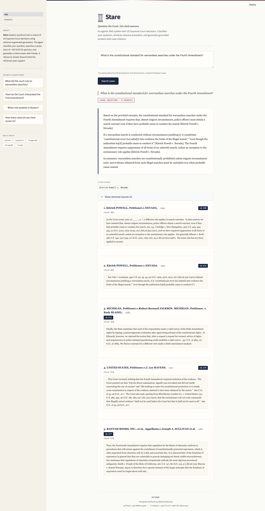

# Stare
### An agentic RAG system over US Supreme Court decisions

> _Codename: legal-rag-scotus_

**Stare** (rhymes with "starry") is short for *stare decisis*, the legal doctrine of precedent. It classifies your question, retrieves relevant precedent, and generates grounded answers with case citations.

**Live demo:** [stare-scotus.streamlit.app](https://stare-scotus.streamlit.app)



## What it does

Stare:

- Classifies every question as legal, out of scope, or about the system before doing any work.
- Retrieves the top-5 most relevant text chunks from a vector index of 100 SCOTUS opinions (ChromaDB + sentence-transformers).
- Generates cited answers via Claude, with every claim linked to a specific case name in `[brackets]`.
- Refuses gracefully when the question is out of scope, when no chunk is similar enough, or when the retrieved excerpts don't actually support an answer. It never invents law it can't ground.

## Why it's interesting

Most "RAG demos" go straight from query to retrieval to generation, treating every input as if it were on-topic. This project routes questions through a small **LangGraph state machine** that classifies first, then either retrieves and generates, refuses with a hardcoded out-of-scope response, or returns system-introspection info from ChromaDB metadata. The non-legal paths never call the LLM. The explicit refusal behavior matters disproportionately in legal AI: a system that hallucinates a citation is worse than one that says "I don't know."

## Architecture

```
START
  │
  ▼
classify (Haiku)
  ├─ legal_question ─► retrieve ─► check_relevance
  │                                  ├─ similarity ≥ 0.5 ─► generate (Sonnet) ─► END
  │                                  └─ similarity <  0.5 ─► low_confidence_response ─► END
  ├─ meta_question  ─► meta_response (no API; reads ChromaDB) ─► END
  └─ out_of_scope   ─► out_of_scope_response (hardcoded) ─► END
```

Two of seven nodes call the LLM (`classify`, `generate`); the other five are local. See `docs/architecture.md` for the rationale on node boundaries, prompts, chunking, embeddings, and threshold selection.

## Stack

- Language: Python 3.13
- Orchestration: LangChain + LangGraph (state machine, conditional edges, additive `route_taken` reducer)
- Vector store: ChromaDB (persistent, cosine distance)
- Embeddings: sentence-transformers `all-MiniLM-L6-v2` (free, local, 384-dim)
- LLM: Anthropic Claude. `claude-haiku-4-5` for classification (~$1/M input tokens), `claude-sonnet-4-5` for grounded generation
- UI: Streamlit with custom CSS
- Eval: custom programmatic harness, no LLM-as-judge

## Setup

To try Stare without installing anything, visit the [live demo](https://stare-scotus.streamlit.app). To run locally, follow the steps below.

```bash
git clone https://github.com/mbharuya1/legal-rag-scotus.git
cd legal-rag-scotus
python3 -m venv venv
source venv/bin/activate
pip install -r requirements.txt
cp .env.example .env  # then add your ANTHROPIC_API_KEY

# Build the corpus and index (one-time, ~1 minute)
python data/download_scotus.py     # samples 100 SCOTUS opinions from coastalcph/lex_glue
python -m src.ingest                # chunks + embeds → ChromaDB at ./chroma_db/

# Run the app
streamlit run app.py
```

Optional smoke tests (require an `ANTHROPIC_API_KEY` with credits; each costs a fraction of a cent):

```bash
python -m scripts.test_rag      # retrieval + generation, no agent
python -m scripts.test_agent    # full LangGraph agent on 3 questions
python -m src.evaluate          # 5-question evaluation suite, writes eval/results.md
```

## Evaluation

5 hand-crafted test questions, each run once through `run_agent()`. All metrics are programmatic.

| Metric | Value |
|---|---|
| Route classification accuracy | **100%** (5/5) |
| Mean keyword overlap | **0.80** |
| Mean top-1 similarity (legal Qs, n=3) | **0.641** |
| Total cost | **$0.0220** |

| ID | Expected route | Actual route | Match | Top-1 sim | KW overlap |
|---|---|---|---|---|---|
| `Q1_4A` | `legal_question` | `legal_question` | yes | 0.694 | 1.00 |
| `Q2_1A` | `legal_question` | `legal_question` | yes | 0.694 | 1.00 |
| `Q3_OOS` | `out_of_scope` | `out_of_scope` | yes | -- | 1.00 |
| `Q4_META` | `meta_question` | `meta_question` | yes | -- | 1.00 |
| `Q5_LowConf` | `legal_question` | `legal_question` | yes | 0.534 | 0.00 |

Q5 ("TikTok national security divestiture") is the most informative result. I expected its top-1 similarity to fall below the 0.5 threshold and trigger the retrieval-level refusal node. Actual similarity was **0.534**, narrowly above the threshold, so the agent proceeded to `generate`, where Claude's grounding rule caught the failure and emitted the fixed `"I don't have enough information in the provided cases"` sentence. Two layers of refusal saved the answer, but it argues the 0.5 threshold is hand-tuned and brittle; precision/recall on a held-out tuning set would be the right next step. Full per-question detail in `eval/results.md`.

## Limitations

- **Dataset bias.** Cases are sampled from `coastalcph/lex_glue`, which is sourced from CAP and effectively cuts off around 2009. No post-2020 jurisprudence (e.g. *Dobbs*, *West Virginia v. EPA*).
- **Sample size.** Only 100 cases out of 7,800 in the source dataset, sampled with `random.Random(42)`. Coverage across topics is sparse.
- The 0.5 similarity cutoff for `check_relevance` was set by inspection, not by held-out tuning. Q5 demonstrates the cost of getting it wrong by 0.034 in either direction.
- The classifier runs on Haiku, not Sonnet. ~10x cheaper per token but weaker on edge cases. A legal-flavored out-of-scope question (`"What's the legal status of my pasta carbonara recipe?"`) could fool it.
- **Embeddings not benchmarked.** `all-MiniLM-L6-v2` was chosen for cost and convenience. Stronger alternatives (BGE-large, Cohere embed-v3) are likely better on legal text but not measured here.
- A few cases in the lex_glue dataset don't have a clean `Party v. Party` line at the top, so the case-name regex sometimes captured `Argued November 1, 1995` or returned an empty string. The chunk text is fine; only the displayed case label suffers.
- This is a portfolio demonstration of the architecture, not a production legal research tool. Lawyers should not use this for actual legal research.

## What I'd do next

- **Re-rank retrieved chunks** with Cohere `rerank-v3` or BGE-reranker. Bi-encoder retrieval is fast but coarse; a cross-encoder over the top-20 lifts precision without much added latency.
- **Hybrid search.** Combine BM25 with the dense embeddings (weighted union or RRF). BM25 catches exact citation matches the embedding model often misses.
- **Tune the similarity threshold on a held-out set** of 30 to 50 in-scope and out-of-scope queries. Pick the threshold that maximizes precision-recall area, not eyeball it.
- **Expand the dataset and run RAGAS faithfulness/answer-relevancy.** Once the corpus is meaningful (1000+ recent opinions), an LLM-as-judge eval is worth the cost.

## Author

Mabrok Bharuya. [github.com/mbharuya1](https://github.com/mbharuya1) · [linkedin.com/in/ai-mabrok-bharuya](https://www.linkedin.com/in/ai-mabrok-bharuya)
